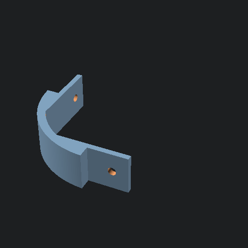

# Misc. CAD projects
A collection of my smaller CAD projects for fixing stuff or just playing around.

## Whiteboard corner
A corner-piece for my whiteboard that broke during a move.

## Phone Holder Ball
I had a random dashboard mount with a wierd connector, so I made this adapter for it.

## Bed leg weight sensor holder
A holder for a weight cell to put under the bed legs. Might be moved to it's own repo when I finish the electronics.

## License
[MIT](LICENSE)